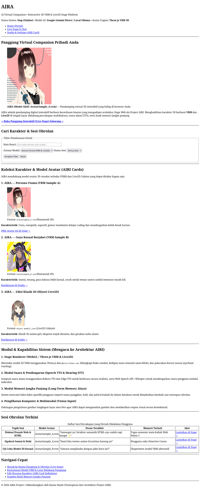
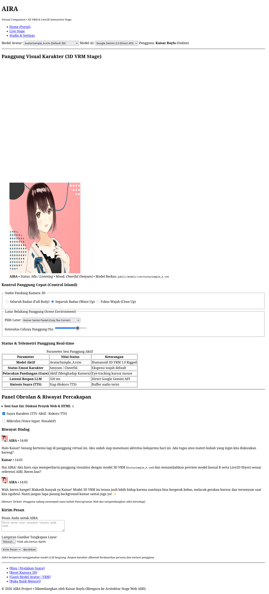
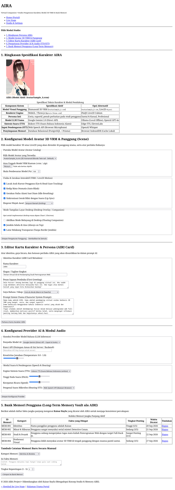

# AIRA — AI Virtual Companion

A web-based AI virtual companion platform developed as a semester-long project for the Web Programming course. The project explores interactive virtual character interfaces, speech synthesis, and persistent memory, taking conceptual inspiration from [Project AIRI](https://github.com/moeru-ai/airi).

The application is built incrementally from Week 2 to Week 14 following the course curriculum (HTML &rarr; CSS &rarr; Tailwind &rarr; JavaScript DOM &rarr; React &rarr; NestJS &rarr; PostgreSQL + Prisma &rarr; AI Integration &rarr; Deployment).

---

## Week 2 — Pure HTML Milestone

The focus for Week 2 is establishing semantic structure, tag completeness, and basic accessibility without any CSS styling or JavaScript logic.

### Pages Overview

| Page | File | Description |
| :--- | :--- | :--- |
| **Portal / Home** | `src/index.html` | Landing page introducing the companion platform, launchpad section, search and filter form, avatar model cards (VRM & Live2D), and a table of recent chat sessions. |
| **Live Stage** | `src/chat.html` | Detail interface for character interaction. Includes a canvas container for 3D model rendering, quick stage controls (camera angles, backgrounds, lighting), live session metrics table, conversation message history, and a multimodal input form. |
| **Studio & Settings** | `src/character.html` | Configuration and data management page. Contains technical persona specifications, avatar and scene motion settings, character system prompt editor, AI provider/audio options, and a long-term memory vault with a manual entry form. |

### Technical & Accessibility Compliance
* **Semantic HTML5:** Built using standard landmark elements (`<header>`, `<nav>`, `<main>`, `<section>`, `<article>`, `<aside>`, `<figure>`, `<figcaption>`, and `<footer>`) rather than nested generic containers.
* **Form Accessibility:** All form controls (`<input>`, `<select>`, `<textarea>`) are linked to their corresponding `<label>` elements via matching `for` and `id` attributes.
* **Image Descriptions:** All `` tags include descriptive `alt` text detailing character appearance and role.
* **Tabular Data:** Structured tables with `<caption>`, `<thead>`, `<tbody>`, `<th scope="col">`, and `<th scope="row">` are implemented for character specs, session history, live metrics, and user memory entries.

---

## Screenshots (Week 2 — Pure HTML)

Rendered directly from the unstyled HTML files:

### 1. Home Portal (`src/index.html`)


---

### 2. Live Stage & Chat (`src/chat.html`)


---

### 3. Studio & Settings (`src/character.html`)


---

## Project Structure

```text
aira/
├── README.md                  # Project documentation and roadmap
├── docs/
│   └── screenshots/           # Weekly progress screenshots
│       ├── index.png          # Index page preview
│       ├── chat.png           # Chat stage preview
│       └── character.png      # Studio page preview
├── public/                    # Static assets
│   ├── images/                # Character and model thumbnails
│   └── models/
│       └── vrm/               # 3D model files (AvatarSample_A.vrm)
└── src/                       # Source HTML files (Week 2)
    ├── index.html             # Main portal page
    ├── chat.html              # Live stage and dialogue page
    └── character.html         # Character configuration and memory vault
```

---

## Getting Started

Since Week 2 only requires pure HTML, no build tools or dependencies are needed:
1. Clone or download the repository.
2. Open `src/index.html` directly in any web browser (Firefox, Chrome, Edge).
3. Use the navigation links at the top and bottom of each page to move between sections.

---

## Semester Roadmap

Official course syllabus roadmap (School of Computing, Telkom University):

### Week 1 — Konsep Dasar Web
- [x] Web architecture fundamentals
- [x] Client-server model & HTTP basics

### Week 2 — HTML
- [x] Semantic HTML structure
- [x] Home page (`index.html`)
- [x] Chat page (`chat.html`)
- [x] Character page (`character.html`)
- [x] Form elements (inputs, labels with `for`/`id`, select, textarea, fieldsets)
- [x] Images with descriptive alt attributes
- [x] Tabular data (`table`, `caption`, `thead`, `tbody`, `th`, `td`)
- [x] Accessibility fundamentals
- [x] Screenshots documentation (`docs/screenshots/`)

### Week 3 — CSS
- [ ] Basic styling and color palette
- [ ] Layout architecture (Flexbox & CSS Grid)
- [ ] Typography
- [ ] Chat bubble interface
- [ ] Centered character stage
- [ ] Responsive design basics

### Week 4 — Bootstrap + Tailwind
- [ ] Bootstrap component exploration
- [ ] Tailwind CSS integration
- [ ] Responsive UI patterns
- [ ] Reusable utility classes

### Week 5 — JavaScript & jQuery
- [ ] Interactive chat UI
- [ ] Dynamic message rendering
- [ ] Form validation
- [ ] Character expression and mood toggles
- [ ] Local mock responses

### Week 6 — React Dasar
- [ ] React project setup
- [ ] Component decomposition
- [ ] State management
- [ ] Chat and stage components
- [ ] Character studio components

### Week 7 — AJAX & Konsumsi API Eksternal/Mock
- [ ] API integration (Fetch / Axios)
- [ ] GET and POST workflows
- [ ] Loading and empty states
- [ ] Error handling
- [ ] Mock API endpoints

### Week 8 — UTS
- [ ] Project demonstration
- [ ] Code refactoring and linting
- [ ] Milestone documentation

### Week 9 — NestJS Dasar + Struktur MVC + (Perbandingan dengan PHP)
- [ ] NestJS backend initialization
- [ ] MVC architecture and module structure
- [ ] Base API endpoints
- [ ] Architectural comparison notes

### Week 10 — Implementasi REST API + PostgreSQL + ORM (Prisma)
- [ ] PostgreSQL database setup
- [ ] Prisma ORM integration and migrations
- [ ] Entity models (User, Character, Conversation, Message, Memory)
- [ ] CRUD operations

### Week 11 — JWT Auth + Keamanan Dasar
- [ ] User registration and login
- [ ] Password hashing with bcrypt
- [ ] JWT authentication guards
- [ ] Protected endpoints
- [ ] Basic web security practices

### Week 12 — Testing + Optimisasi Performa
- [ ] Backend unit and integration tests (Jest)
- [ ] Request validation using DTOs
- [ ] Authentication test suites
- [ ] Performance optimization

### Week 13 — Integrasi Layanan Kecerdasan Buatan (AI) Berbasis API
- [ ] Direct LLM API connection (Google Gemini / OpenAI)
- [ ] Character persona prompt engineering
- [ ] Long-term memory retrieval and injection
- [ ] Conversation persistence

### Week 14 — Deploy
- [ ] Production frontend build
- [ ] Backend deployment
- [ ] Cloud PostgreSQL instance
- [ ] Environment variables and CORS configuration
- [ ] Live demo deployment

### Week 15 — UAS - (1) / Responsi
- [ ] Project review and preparation
- [ ] Teaching assistant defense session

### Week 16 — UAS - (2)
- [ ] Final evaluation and course wrap-up
