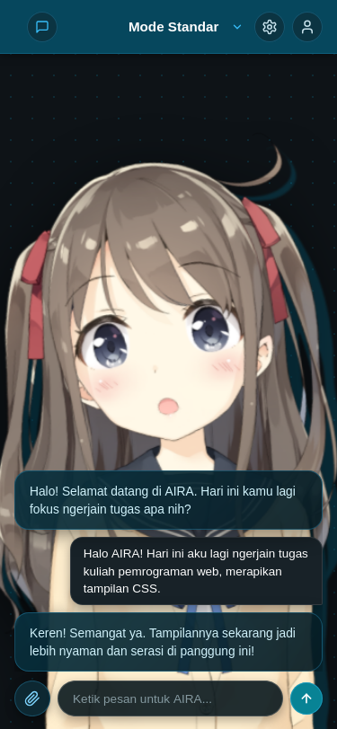
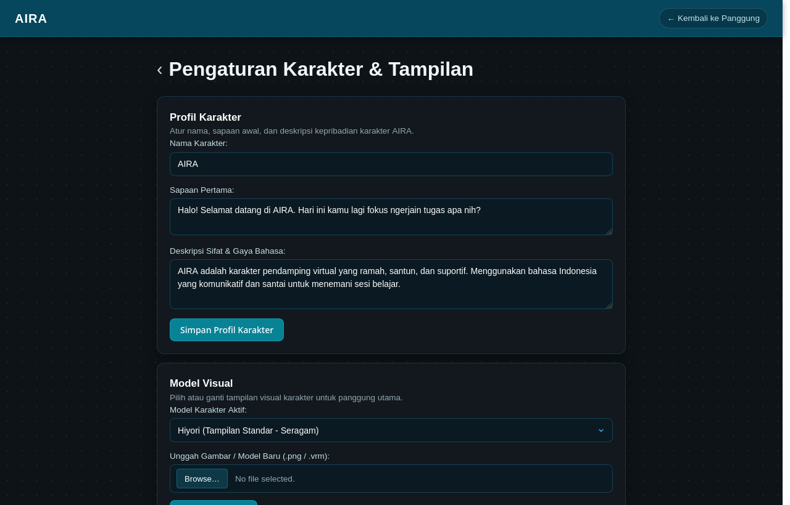
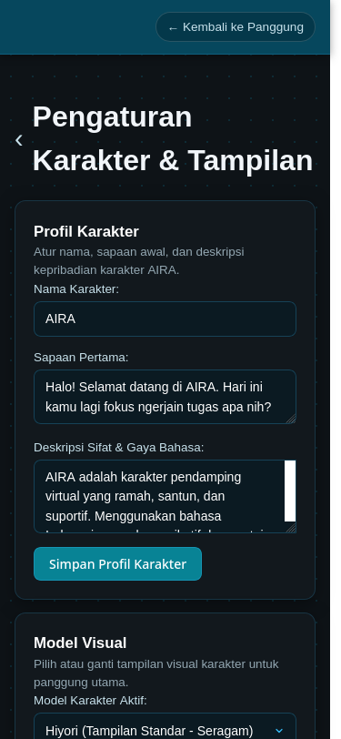
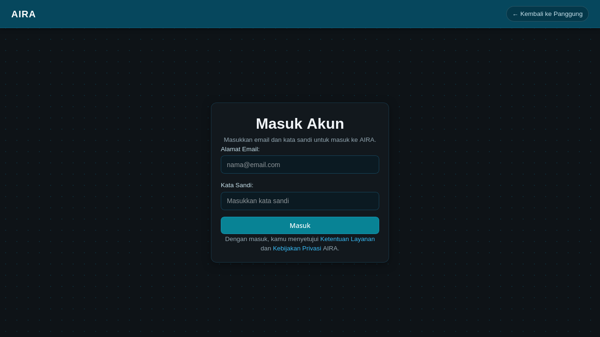
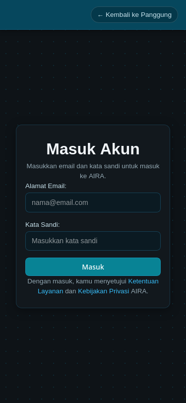

# AIRA — AI Virtual Companion

A web-based AI virtual companion platform developed as a semester-long project for the Web Programming course. The project explores interactive virtual character interfaces, speech synthesis, and persistent memory, taking conceptual inspiration from [Project AIRI](https://github.com/moeru-ai/airi).

The application is built incrementally from Week 2 to Week 14 following the course curriculum (HTML &rarr; CSS &rarr; Tailwind &rarr; JavaScript DOM &rarr; React &rarr; NestJS &rarr; PostgreSQL + Prisma &rarr; AI Integration &rarr; Deployment).

---

## Week 2 — Pure HTML Milestone

The focus for Week 2 is establishing semantic structure, tag completeness, and basic accessibility without any CSS styling or JavaScript logic.

### Pages Overview

| Page | File | Description |
| :--- | :--- | :--- |
| **Live Stage** | `src/index.html` | Primary interactive stage modeled after AIRI. Features the central character stage (Hiyori Live2D), floating dark-teal chat drawer with message bubbles and input bar, corner telemetry table, and camera controls. |
| **Studio & Settings** | `src/settings.html` | Settings hub inspired by AIRI's settings list. Contains configuration cards for character persona (AIRA Card), models (VRM/Live2D), long-term memory vault table, LLM provider options, and system toggles. |
| **Sign In** | `src/login.html` | Minimalist centered authentication interface modeled after AIRI's sign-in flow. Includes email input, social login buttons, terms notice, and account benefits comparison table. |

### Technical & Accessibility Compliance
* **Semantic HTML5:** Built using standard landmark elements (`<header>`, `<nav>`, `<main>`, `<section>`, `<article>`, `<aside>`, `<figure>`, `<figcaption>`, and `<footer>`) rather than nested generic containers.
* **Form Accessibility:** All form controls (`<input>`, `<select>`, `<textarea>`) are linked to their corresponding `<label>` elements via matching `for` and `id` attributes.
* **Image Descriptions:** All `` tags include descriptive `alt` text detailing character appearance and role.
* **Tabular Data:** Structured tables with `<caption>`, `<thead>`, `<tbody>`, `<th scope="col">`, and `<th scope="row">` are implemented for character specs, session history, live metrics, and user memory entries.

---

## Week 3 — Native CSS & Responsive Milestone

Building upon the semantic HTML structure from Week 2, Week 3 introduces an external stylesheet (`src/style.css`) implementing pure native CSS (no frameworks). The design is faithfully modeled after [Project AIRI](https://github.com/moeru-ai/airi) (`airi.moeru.ai`), creating an immersive virtual companion stage.

### Styling & Implementation Highlights
* **Visual Identity & Palette:** Sampled directly from AIRI's interface—featuring a dark canvas (`#141618`) with a subtle teal dot grid (`rgba(14, 75, 95, 0.35)`), a deep teal header (`#06475d`), and translucent glassmorphic card surfaces (`rgba(12, 42, 53, 0.92)`).
* **Organic Scallop Wave Header:** The top header features a custom repeating scallop wave silhouette along its bottom border, framing the stage seamlessly.
* **Immersive Character Stage:** The character model (Hiyori Live2D) is positioned directly on the stage canvas without bounding boxes, grounded naturally towards the bottom.
* **Glassmorphic Floating Chat Drawer:** Positioned on the right side with transparent dialogue bubbles, distinguishing AIRA's responses (deep teal card) from user messages (dark charcoal pill on the right), complete with a circular cyan send button and attachment controls.
* **Corner Widgets:** Telemetry metrics and stage controls are packaged into compact collapsible widgets (`<details>`) at the corners, keeping the center stage clear while preserving full tabular and form requirements.
* **Responsive Design (`@media` queries):** 
  - **Desktop:** Full dual-panel layout with central character stage and right-hand floating chat drawer.
  - **Mobile ($\le 768\text{px}$):** Layout layar penuh responsif ala *companion app*, di mana karakter berdiri terpusat, navbar persegi panjang minimalis dengan pemilih sesi obrolan native dan akses akun, serta panel percakapan melayang rapi di bagian bawah.

---

## Screenshots (Desktop & Mobile Previews)

### 1. Live Stage (`src/index.html`)

| Desktop View (1568 &times; 882) | Mobile View (390 &times; 844) |
| :---: | :---: |
|  |  |

---

### 2. Studio & Settings (`src/settings.html`)

| Desktop View | Mobile View |
| :---: | :---: |
|  |  |

---

### 3. Sign In (`src/login.html`)

| Desktop View | Mobile View |
| :---: | :---: |
|  |  |

---

## Project Structure

```text
aira/
├── README.md                  # Project documentation and roadmap
├── docs/
│   └── screenshots/           # Weekly progress screenshots (desktop & mobile)
│       ├── index.png          # Live stage desktop preview
│       ├── index-mobile.png   # Live stage mobile preview
│       ├── settings.png       # Settings hub desktop preview
│       ├── settings-mobile.png # Settings hub mobile preview
│       ├── login.png          # Sign in desktop preview
│       └── login-mobile.png   # Sign in mobile preview
├── public/                    # Static assets
│   ├── images/                # Character models and thumbnails (Hiyori, Avatars)
│   └── models/
│       └── vrm/               # 3D model files (AvatarSample_A.vrm)
└── src/                       # Source files
    ├── style.css              # External stylesheet (Week 3 native CSS)
    ├── index.html             # Live stage page (Home)
    ├── settings.html          # Studio & Settings page
    └── login.html             # Authentication & Sign in page
```
---

## Getting Started

Since Week 2 only requires pure HTML, no build tools or dependencies are needed:
1. Clone or download the repository.
2. Open `src/index.html` directly in any web browser (Firefox, Chrome, Edge).
3. Use the navigation links at the top and bottom of each page to move between sections.

---

## Semester Roadmap

Official course syllabus roadmap (School of Computing, Telkom University):

### Week 1 — Konsep Dasar Web
- [x] Web architecture fundamentals
- [x] Client-server model & HTTP basics

### Week 2 — HTML
- [x] Semantic HTML structure
- [x] Home page (`index.html`)
- [x] Chat page (`chat.html`)
- [x] Character page (`character.html`)
- [x] Form elements (inputs, labels with `for`/`id`, select, textarea, fieldsets)
- [x] Images with descriptive alt attributes
- [x] Tabular data (`table`, `caption`, `thead`, `tbody`, `th`, `td`)
- [x] Accessibility fundamentals
- [x] Screenshots documentation (`docs/screenshots/`)

### Week 3 — CSS
- [x] External stylesheet (`src/style.css`) linked across all pages
- [x] Color palette & visual identity faithfully inspired by AIRI
- [x] Typography hierarchy and font properties
- [x] Customized lists and navigation pill buttons
- [x] Text alignment and glassmorphic card containers
- [x] Chat bubble interface (AIRA card vs user pill)
- [x] Seamless centered character stage
- [x] Responsive layout with `@media` queries (desktop & mobile views)
- [x] Desktop & mobile screenshots documentation (`docs/screenshots/`)
### Week 4 — Bootstrap + Tailwind
- [ ] Bootstrap component exploration
- [ ] Tailwind CSS integration
- [ ] Responsive UI patterns
- [ ] Reusable utility classes

### Week 5 — JavaScript & jQuery
- [ ] Interactive chat UI
- [ ] Dynamic message rendering
- [ ] Form validation
- [ ] Character expression and mood toggles
- [ ] Local mock responses

### Week 6 — React Dasar
- [ ] React project setup
- [ ] Component decomposition
- [ ] State management
- [ ] Chat and stage components
- [ ] Character studio components

### Week 7 — AJAX & Konsumsi API Eksternal/Mock
- [ ] API integration (Fetch / Axios)
- [ ] GET and POST workflows
- [ ] Loading and empty states
- [ ] Error handling
- [ ] Mock API endpoints

### Week 8 — UTS
- [ ] Project demonstration
- [ ] Code refactoring and linting
- [ ] Milestone documentation

### Week 9 — NestJS Dasar + Struktur MVC + (Perbandingan dengan PHP)
- [ ] NestJS backend initialization
- [ ] MVC architecture and module structure
- [ ] Base API endpoints
- [ ] Architectural comparison notes

### Week 10 — Implementasi REST API + PostgreSQL + ORM (Prisma)
- [ ] PostgreSQL database setup
- [ ] Prisma ORM integration and migrations
- [ ] Entity models (User, Character, Conversation, Message, Memory)
- [ ] CRUD operations

### Week 11 — JWT Auth + Keamanan Dasar
- [ ] User registration and login
- [ ] Password hashing with bcrypt
- [ ] JWT authentication guards
- [ ] Protected endpoints
- [ ] Basic web security practices

### Week 12 — Testing + Optimisasi Performa
- [ ] Backend unit and integration tests (Jest)
- [ ] Request validation using DTOs
- [ ] Authentication test suites
- [ ] Performance optimization

### Week 13 — Integrasi Layanan Kecerdasan Buatan (AI) Berbasis API
- [ ] Direct LLM API connection (Google Gemini / OpenAI)
- [ ] Character persona prompt engineering
- [ ] Long-term memory retrieval and injection
- [ ] Conversation persistence

### Week 14 — Deploy
- [ ] Production frontend build
- [ ] Backend deployment
- [ ] Cloud PostgreSQL instance
- [ ] Environment variables and CORS configuration
- [ ] Live demo deployment

### Week 15 — UAS - (1) / Responsi
- [ ] Project review and preparation
- [ ] Teaching assistant defense session

### Week 16 — UAS - (2)
- [ ] Final evaluation and course wrap-up
